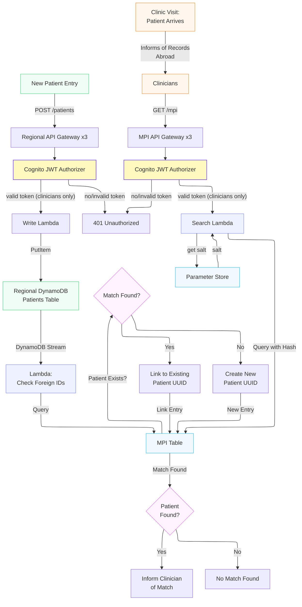

# Multi-Region EHR API (Prototype)

A cross-border health record prototype designed to respect **GDPR** and **NHS DSPT** requirements. It follows simplified **FHIR R4 structures**.  
The aim is to demonstrate how a federated model can allow clinicians in the UK, Germany, and France to locate and view records without centralising clinical data.

---

## 1. Overview

Sharing healthcare data across countries is complicated. This project takes a practical approach: **keep data in the patient’s home region**, while allowing clinicians to locate records when needed; cross-region viewing is the next milestone (see Roadmap).

* **Federated Master Patient Index (MPI):** Links the same person across regions without exposing raw identifiers.
* **Serverless Architecture:** Built fully on AWS (Lambda, API Gateway, DynamoDB).
* **Data Residency:** Regional DynamoDB tables store medical data; the Global MPI stores *only* pseudonymised pointers.

---

## 2. Core Architecture (Currently Implemented)
*Prototype note: table count and record schemas are deliberately simplified; the focus is the residency and linking architecture, not clinical data modelling.*

* **Regional Vaults:** Each country (UK/DE/FR) has its own DynamoDB table for Patient resources.  
* **DynamoDB Global Table (MPI):** Stores the pseudonymised Master Patient Index (hashes + UUIDs). Read returns the UUID for E2E verification.
* **Secure Linking:** Lambda functions hash national IDs using a salt stored in **AWS Systems Manager Parameter Store**.
* **Edge & API Layer:** Regional REST APIs managed via **Amazon API Gateway** .
* **Compute (Lambdas):** 
    * **Search Service:** Python Lambda for ID hashing and MPI lookup.
    * **CRUD Services:** Create/Read/Update Lambdas for Patient resources.
* **Auto-Registration (DynamoDB Streams):** When a new patient is created in a regional vault, the stream triggers a registrar Lambda. It hashes disclosed foreign national IDs and queries the MPI. On a match, it links the new record to the existing UUID; otherwise, it creates a new one. 
* **Cross-Border Access:** No clinical data crosses borders; only hashes and UUIDs reach the global MPI.
* Restrict API Gateway using **Amazon Cognito** (User Pools, JWT authorizer on every route, RBAC via cognito groups (clinicians, auditors): patient-data routes are clinicians-only, fail-closed; auditors deliberately get no record access (data minimisation), their surface arrives with the logging layer).

---

## 3. Data Flow (Clinic Visit)

1.  **Patient Identification:** Patient arrives and informs the clinician of records in another country.
2.  **Search:** Clinician enters the foreign National Health ID.
3.  **Hash & Lookup:** Search Lambda retrieves the salt, hashes the ID, and queries the MPI.
4.  **Federated Retrieval:** If a match is found, the system fetches relevant clinical data from that specific country’s regional table. Federated retrieval follows authentication. **(planned)** 
5.  **Aggregation:** Records are merged **in memory** and displayed to the clinician. **Nothing is written centrally. (planned)**
6.  **Analysis:** New notes trigger DynamoDB Streams → Analysis Lambda → Coded insights. **(planned)**
7.  **Visualization:** Frontend aggregates insights into a clinical timeline (browser-side only). **(planned)**

*  **Creation:** New records are stored only in the region where they are created, maintaining strict data sovereignty.
*  **Audit:** Logs are stored in both the requesting region (access) and the source region (data retrieval). **(planned)**

---

## 4. Development, Operations & Threat Model

* **Infrastructure as Code:** Terraform manages all resources.
* **Monitoring:** CloudWatch Logs.
* **Testing:** Manual end-to-end smoke tests across 3 regions.
* **Policy Enforcement:** Deny-by-default IAM policies.

**Zero Trust Approach:**
* **Cross-Region Data Leakage:** Mitigated by ensuring no raw data is stored globally (only pseudonymised MPI pointers cross borders). **(implemented)**
* **Unauthorized Access:** Mitigated via IAM least privilege, and role-based access, **(implemented)** and Cognito MFA. **(planned)**
* **Lateral Movement:** Mitigated via separate VPCs (prototype) or AWS accounts (production) with private API endpoints. **(planned)**

---

## 5. Roadmap & Future Work

### Phase 1: Prototype Completion
* **Security & Network:** 
    * Enforce MFA.
    * Protect frontend/API with **Amazon CloudFront + AWS WAF**.
    * Move Lambdas to private subnets within VPCs and route traffic via **VPC Endpoints (PrivateLink)**.
    * Add regional **AWS KMS Customer Managed Keys (CMKs)** for encryption at rest.
* **Data & Operations:**
    * Implement transient cross-border memory access (no data persistence).
    * Expand Regional Vaults to include Encounter and Observation tables + corresponding CRUD Lambdas.
    * MPI read to return existence + region only.
    * **CI/CD Pipeline:** GitHub Actions for automated deployment.
    * **Audit:** Enforce CloudTrail API auditing with 14-day retention and log "Purpose of Use".
    * **Frontend:** Build clinician-facing UI hosted on S3 + CloudFront.

### Phase 2: Production Readiness
* **Compliance & Nuance:**
    * **UK (NHS DSPT):** Strict auditing, zero trust, data minimization.
    * **EU (GDPR):** Data residency and automated workflows for the "Right to Erasure" (Art. 17).
    * Immutable auditing via CloudTrail + S3 Object Lock (7–10 year retention).
* **Advanced Architecture:**
    * Multi-Account Strategy (AWS Organizations) separating Security, Workloads, and Research OUs.
    * Migrate salt to **AWS Secrets Manager** with automated rotation.
    * Application hardening: SQS Dead Letter Queues (DLQs), Provisioned Concurrency, and rate limiting.
* **Clinical & AI Integration:**
    * **Expanded FHIR & SNOMED CT:** Full integration of real clinical codes (e.g., Asthma, MRI).
    * **EventBridge/SNS Alerting** for critical observations.
    * **AI Analysis:** Comprehend Medical integration for cross-border context and language translation.
    * **Longitudinal Pattern Detection** and Visual Clinical Timelines via QuickSight or custom frontend.

---

## 6. License
MIT