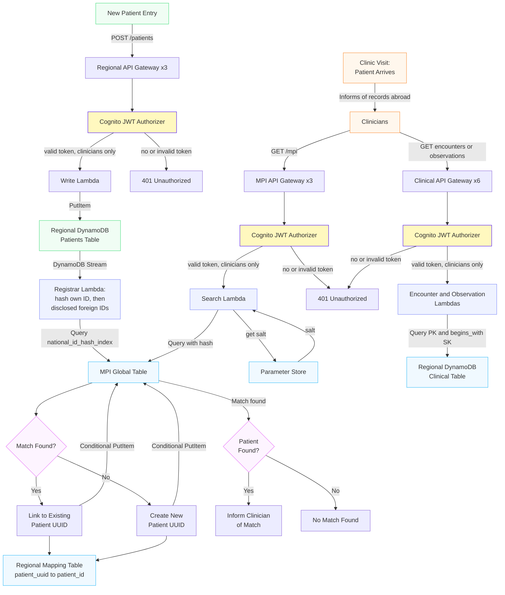

# Multi-Region EHR API


A cross-border health record prototype built on AWS.
UK · Germany · France
Terraform · Python · FHIR R4 · DynamoDB · Lambda · API Gateway · Cognito

The prototype explores a simple constraint:

**The patient can cross a border. The clinical record doesn't have to.**

One person can have records in several healthcare systems, each using its own national identifier. Those systems need to recognise that the records belong to the same person — without building a central clinical database. So the federated Master Patient Index stores pseudonymised identifiers and UUIDs, never clinical records.

That constraint is regulatory as much as architectural. **GDPR** governs where personal data may lawfully reside, and **NHS DSPT** requires strict auditing, zero trust and data minimisation. Residency, pseudonymisation and least-privilege access are requirements here, not preferences — which is why they show up as hard boundaries in the design rather than as configuration.

The current implementation covers regional patient and clinical stores, pseudonymised identity linking, authentication and RBAC, automated MPI registration, and the infrastructure to support federated retrieval. Cross-border clinical retrieval is the next milestone.

---

## 1. Core Architecture

*Prototype note: table count and record schemas are deliberately simplified; the focus is the residency and linking architecture, not clinical data modelling.*



### Regional data

Each country has:

* a `patients` table containing FHIR Patient resources
* a `clinical` table containing Encounter and Observation resources
* a `mapping_table_<region>` mapping the global `patient_uuid` to that region's own `patient_id`

The federated MPI contains only the pseudonymised identity layer.

### The regional identity boundary

A regional clinical table is keyed by its own patient ID:

```text
PK = PATIENT#<local patient_id>
SK = <TYPE>#<datetime>#<id>
```

The global UUID therefore cannot directly retrieve a clinical record. The mapping table is the boundary between the two identities, and it lives inside the region that issued the local ID — so that ID never crosses a border.

### Shared code

A per-region Lambda layer publishes `ehr_helpers`: `parse_groups` for the Cognito group check, `salted_hash` for pseudonymisation. All 11 handlers import from it, so the authorisation check and the hash function each exist once rather than being copied per function. Both take everything they need as arguments, which is what makes them testable without AWS.

---

## 2. Identity linking

When a new patient is registered, the regional record is written first. A DynamoDB Stream then invokes the registrar, which:

1. hashes the record's own national ID;
2. searches the MPI;
3. if there is no match, hashes any disclosed foreign identifiers;
4. links to an existing UUID if one is found;
5. otherwise creates a new UUID;
6. writes the UUID → local patient ID mapping in the same region.

The national IDs themselves never enter the global table. Both the MPI and mapping writes use DynamoDB conditional expressions, so an established binding cannot silently be replaced by a conflicting one.

The invariant is deliberate: **one local `patient_id` per `patient_uuid` per region.** A write that would bind an established identity to a different local record is refused rather than overwriting it. This prevents one local record from being silently absorbed into another person's identity.

That guard is an integrity constraint, not an identity check. It protects an identity once a binding exists, but it cannot establish that a disclosed foreign identifier actually belongs to the person presenting it. That is a separate trust problem addressed in the roadmap.

Searching by the record's *own* hash first also makes the registrar idempotent: a replayed stream record resolves to the UUID already written rather than minting a second one.

### The interesting case

The same person arrives in three systems.

**United Kingdom**

```text
UK national ID
      ↓
new UUID
```

**Germany**

```text
German national ID
      ↓
discloses UK national ID
      ↓
existing UUID
```

**France**

```text
French national ID
      ↓
discloses German national ID
      ↓
German record already carries the inherited UUID
      ↓
same UUID
```

France never needs to know about the UK. It only needs to know about Germany, and the chain still resolves to one identity.

---

## 3. Deployment & Walkthrough

### 3.1 Prerequisites

* AWS account with credentials configured
* Terraform ≥ 1.2
* A pseudonymisation salt in AWS Systems Manager Parameter Store, in all three regions:

```bash
for r in eu-west-2 eu-central-1 eu-west-3; do
  aws ssm put-parameter --name /mpi/salt --type SecureString \
    --value '<your-salt>' --region "$r"
done
```

The same salt must be used in every region. Cross-border matching works by comparing hashes, so a hash written in one region has to be reproducible in another.

### 3.2 Deploy

```bash
cd terraform
terraform init
terraform apply
```

One apply builds the stack across all three regions. The API invoke URLs are returned as Terraform outputs.

### 3.3 Test users

Create a clinician and an auditor in the Cognito user pool (pool and client IDs are in the Terraform outputs):

```bash
POOL=<cognito_user_pool_id output>
CLIENT=<cognito_user_pool_client_id output>

for u in testclinician testauditor; do
  aws cognito-idp admin-create-user --user-pool-id "$POOL" \
    --username "$u" --temporary-password '<a-temp-password>'
done

aws cognito-idp admin-set-user-password --user-pool-id "$POOL" \
  --username testclinician --password '<clinician-password>' --permanent

aws cognito-idp admin-set-user-password --user-pool-id "$POOL" \
  --username testauditor --password '<auditor-password>' --permanent

aws cognito-idp admin-add-user-to-group --user-pool-id "$POOL" \
  --username testclinician --group-name clinicians

aws cognito-idp admin-add-user-to-group --user-pool-id "$POOL" \
  --username testauditor --group-name auditors
```

### 3.4 Shell setup

```bash
# UK (eu-west-2)
PATIENT_UK=<patient_api_url_uk>
ENC_UK=<encounters_api_url_uk>
OBS_UK=<observations_api_url_uk>
MPI_UK=<mpi_api_url_uk>
# DE (eu-central-1) and FR (eu-west-3): same pattern from the outputs

CLIN_PW='<clinician-password>'
AUD_PW='<auditor-password>'

region() {
  local r=${1:-uk}
  case "$r" in
    uk) PATIENT=$PATIENT_UK; ENC=$ENC_UK; OBS=$OBS_UK; MPI=$MPI_UK ;;
    de) PATIENT=$PATIENT_DE; ENC=$ENC_DE; OBS=$OBS_DE; MPI=$MPI_DE ;;
    fr) PATIENT=$PATIENT_FR; ENC=$ENC_FR; OBS=$OBS_FR; MPI=$MPI_FR ;;
    *)  echo "unknown region: $r"; return 1 ;;
  esac
  REGION=$r; echo "region: $r"
}

mint() {
  CLIN=$(aws cognito-idp initiate-auth --auth-flow USER_PASSWORD_AUTH \
    --client-id "$CLIENT" \
    --auth-parameters USERNAME=testclinician,PASSWORD="$CLIN_PW" \
    --query 'AuthenticationResult.IdToken' --output text)
  AUD=$(aws cognito-idp initiate-auth --auth-flow USER_PASSWORD_AUTH \
    --client-id "$CLIENT" \
    --auth-parameters USERNAME=testauditor,PASSWORD="$AUD_PW" \
    --query 'AuthenticationResult.IdToken' --output text)
  echo "CLIN=${CLIN:0:12}...  AUD=${AUD:0:12}..."
}

api() {
  local base=$1 method=$2 route=$3 token=$4; shift 4
  curl -sS -i -X "$method" "${base%/}$route" \
    -H "Authorization: Bearer $token" \
    -H "Content-Type: application/json" "$@"
}

pat() { api "$PATIENT" "$@"; }
enc() { api "$ENC"     "$@"; }
obs() { api "$OBS"     "$@"; }
mpi() { api "$MPI"     "$@"; }
```

Tokens expire after one hour; re-run `mint` when everything starts returning 401.

---

## 4. Authentication and RBAC

Every API route is protected by a Cognito JWT authoriser. The prototype has two groups: `clinicians` and `auditors`. Clinicians can reach patient-data routes; auditors can authenticate but deliberately receive no patient-data access.

```bash
region uk && mint

pat POST /patients "$CLIN" -d @data/patient_uk_example.json

curl -i "${PATIENT%/}/patients/pat-uk-200"        # no token
HTTP/2 401

pat GET /patients/pat-uk-200 "$CLIN"              # clinician
HTTP/2 200

pat GET /patients/pat-uk-200 "$AUD"               # auditor
HTTP/2 403
```

Same endpoint. Same authentication mechanism. Different authorisation result.

---

## 5. Follow a patient across borders

The UK record was registered in §4. Germany now registers the same person and discloses the UK national ID:

```bash
region de
pat POST /patients "$CLIN" -d @data/patient_de_example.json
```

The registrar matches the disclosed identifier against the MPI. Either identifier can now locate the corresponding regional record:

```bash
region de
mpi GET "/mpi?national_id=<UK national ID>" "$CLIN"
HTTP/2 200
[{"region": "uk", "patient_uuid": "7956c0ad-a8b6-44d6-add2-940f4f90c745"}]

region uk
mpi GET "/mpi?national_id=<DE national ID>" "$CLIN"
HTTP/2 200
[{"region": "de", "patient_uuid": "7956c0ad-a8b6-44d6-add2-940f4f90c745"}]
```

The response exposes the region and the UUID. It does not expose the hash or the underlying identifier.

### Then France joins

The French record discloses only the German identifier:

```bash
region fr
pat POST /patients "$CLIN" -d @data/patient_fr_example.json

mpi GET "/mpi?national_id=<FR national ID>" "$CLIN"
HTTP/2 200
[{"region": "fr", "patient_uuid": "7956c0ad-a8b6-44d6-add2-940f4f90c745"}]
```

France never mentions Britain. The UUID still resolves to the same person.

### Registration order

This prototype deliberately exposes an interesting limitation. Linking is driven by what the *incoming* record discloses, so UK → DE → FR works because each new record names an identifier already in the MPI. Register the same records in another order and the links can remain unresolved — silently, with no error. Reciprocal disclosure and a back-fill process for out-of-order registration are future work.

---

## 6. Clinical records

Clinical data stays regional.

```bash
enc GET /patients/pat-uk-200/encounters   "$CLIN"
obs GET /patients/pat-uk-200/observations "$CLIN"
```

Encounter and Observation resources share a key structure, so records can be queried by patient and resource type in chronological order within that type. Updates are PATCH requests against the existing sort key, changing only the fields supplied in the body.

---

## 7. Data Flow — Clinic Visit


The regional mapping tables are the hinge of the read path.

The MPI answers *which region* and *which UUID*. The regional mapping table answers *which local patient ID*. Only then can the regional clinical store be queried. The local patient ID stays inside the region that issued it, and the requesting region persists nothing.

### Planned read path

1. Patient identifies a record held abroad.
2. Clinician supplies the foreign National Health ID.
3. Search Lambda hashes the identifier and queries the MPI.
4. The target region resolves `patient_uuid → patient_id`.
5. Clinical records are retrieved from the target region.
6. Records are held in memory for presentation.
7. Nothing is written to the global MPI or to the requesting region.

The tables required for this flow are deployed and populated. Federated retrieval is the next implementation milestone.

---

## 8. Boundary rules

The architecture has one deliberately strict rule:

**The MPI never writes to a regional vault.**

```text
Regional vault
      │
      │ DynamoDB Stream
      ▼
 Registrar
      │
      ├──────► Global MPI
      │
      └──────► Regional mapping table
```

There is no reverse path from the MPI into a regional patient or clinical table. It is also why disclosed `knownForeignIds` stay on the record that disclosed them rather than being stripped after matching — removing them would mean MPI machinery writing into a regional vault.

The rule is checkable rather than aspirational: the registrar holds no write permission on any patients table.

---

## 9. Operations & Threat Model

### Infrastructure

* Terraform manages the infrastructure.
* GitHub Actions runs `terraform fmt`, `terraform validate` and `ruff` on every push, with no AWS credentials required.
* CloudWatch provides application logging.
* Manual end-to-end smoke tests exercise the three regions.
* IAM policies deny by default.

### Current protections

Each maps to a requirement named at the top of this document, and each is enforced structurally rather than by convention.

**Cross-region data leakage** — only pseudonymised MPI pointers cross regions; clinical data remains regional. What actually crosses a border is a salted hash and a UUID, neither of which identifies a person without the salt, and the salt never leaves Parameter Store. *GDPR residency; DSPT data minimisation.*

**Silent identity overwrite** — conditional writes prevent established UUID → hash and UUID → patient ID bindings from being replaced by conflicting values. *GDPR Article 5(1)(d), accuracy — though it is a patient-safety concern before it is a legal one: a wrongly merged identity files one person's clinical history under another's name.*

**Unauthorised access** — Cognito JWT authorisation, Cognito groups and least-privilege IAM restrict patient-data routes to clinicians, fail-closed. Auditors authenticate successfully and are still refused. *DSPT access control; GDPR Article 32, security of processing.*

### Still to implement

The largest gap is auditing. NHS DSPT expects a record of who accessed what, when and why; the prototype has CloudWatch application logs and no access trail. Everything below is ordered by how much it matters, not by effort.

* **CloudTrail auditing and purpose-of-use logging** — the gap described above, and the prerequisite for any DSPT claim.
* **Cognito MFA** — DSPT access control. A password alone is thin protection for a clinician account that can read patient data.
* **Regional KMS customer-managed keys** — GDPR Article 32. Encryption at rest currently uses AWS-managed keys, so the keys are not held under regional control.
* **Private regional networking** — the APIs are public endpoints protected by authorisation alone.
* **CloudFront + WAF** — perimeter protection and rate limiting in front of those endpoints.
* **Stronger isolation between regional workloads** — separate AWS accounts per region in production, rather than one account with three providers.

---

## 10. Roadmap

### Prototype completion

* **Federated clinical read** — the regional mapping tables are deployed and populated, but nothing consumes them yet. Wire the clinical read handlers to resolve `patient_uuid → patient_id` in the target region and fetch the record there (§7, steps 4–5).
* **Transient cross-border memory access** — no data persistence in the requesting region.
* **Reciprocal MPI linking** — linking is driven by what an incoming record discloses, so registration order decides whether two records resolve to one identity; add a back-fill pass so a later disclosure links records registered earlier.
* **Paginate clinical reads** — reads currently return only the first 1 MB; handle `LastEvaluatedKey` to page through full histories.
* **Verify disclosed foreign identifiers** — the registrar currently trusts that a disclosed foreign ID belongs to the person presenting it. The conditional writes protect existing identity bindings, but they cannot establish that the supplied identifier belongs to the patient. The intended controls are clinician attestation recorded at registration, MFA on the clinician's account, and out-of-band confirmation with the patient's home region.
* **Stream failure handling** — bound retries, bisect batches on error, and add a dead-letter queue, so a permanently failing registration surfaces instead of ageing out of the stream.
* **CI/CD pipeline** — the validation workflow is in place; automated deployment on merge is still to come.
* **Audit** — CloudTrail API auditing with 14-day retention, logging "Purpose of Use".
* **MFA** and a clinician-facing **frontend** on S3 + CloudFront.

### Production readiness

* **Compliance** — UK NHS DSPT (strict auditing, zero trust, data minimisation); EU GDPR (data residency and automated Right to Erasure workflows); immutable auditing via CloudTrail + S3 Object Lock.
* **Historical MPI migration** — bulk onboarding of existing records, including the global-table replication race that can otherwise mint duplicate UUIDs for one person during parallel regional imports.
* **Stronger pseudonymisation** — migrate from salted SHA-256 to HMAC-SHA256 or a KDF. Note this invalidates every stored hash and requires re-registration.
* **Nested update handling** — `SET period.end` fails if a record has no `period` map.
* **Multi-account strategy** (AWS Organizations) separating Security, Workloads and Research OUs.
* **Secrets Manager** for the salt, with rotation.
* **Application hardening** — SQS dead letter queues, provisioned concurrency, rate limiting.
* **Expanded FHIR and SNOMED CT** — full integration of real clinical codes.
* **Event-driven clinical alerts** via EventBridge/SNS, and longitudinal analysis and visualisation.

---

## 11. License

MIT
