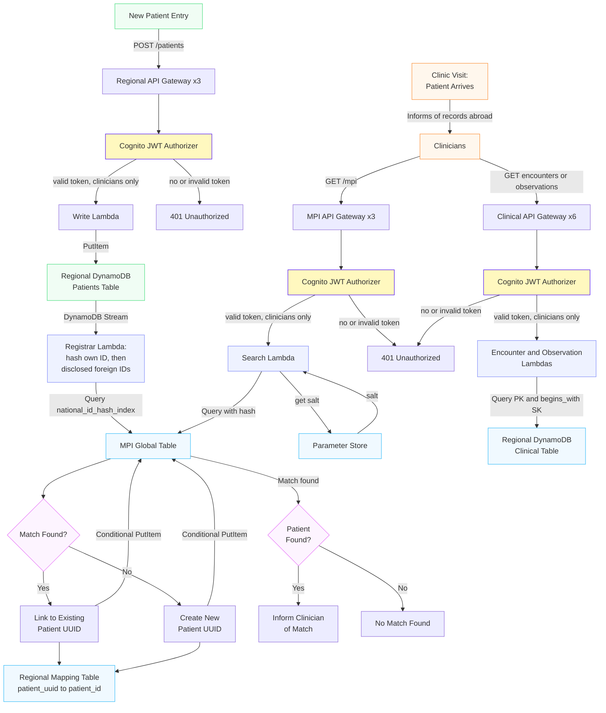

# Multi-Region EHR API (Prototype)



A cross-border health record prototype designed to respect **GDPR** and **NHS DSPT** requirements. It follows simplified **FHIR R4 structures**.  
The aim is to demonstrate how a federated model can allow clinicians in the UK, Germany, and France to locate and view records without centralising clinical data.

---

## 1. Overview

Sharing healthcare data across countries is complicated. This project takes a practical approach: **keep data in the patient’s home region**, while allowing clinicians to locate records when needed; cross-region viewing is the next milestone (see Roadmap).

* **Federated Master Patient Index (MPI):** Links the same person across regions without exposing raw identifiers.
* **Serverless Architecture:** Built fully on AWS (Lambda, API Gateway, DynamoDB).
* **Data Residency:** Regional DynamoDB tables store medical data; the Global MPI stores *only* pseudonymised pointers.

---

## 2. Core Architecture (Currently Implemented)
*Prototype note: table count and record schemas are deliberately simplified; the focus is the residency and linking architecture, not clinical data modelling.*



* **Regional Vaults:** Each country (UK/DE/FR) has its own DynamoDB table for Patient resources.
* **Clinical Vaults:** Each country has a second DynamoDB table (`clinical`) storing Encounter and Observation resources under a shared key schema (`PK = PATIENT#<id>`, `SK = <TYPE>#<datetime>#<id>`), so one Query per resource type returns a patient's clinical history in chronological order within that type.
* **DynamoDB Global Table (MPI):** Stores the pseudonymised Master Patient Index (hashes + UUIDs). Read returns existence, region and UUID only; the hash value is never disclosed.
* **Regional Mapping Tables:** One `mapping_table_<region>` per country, holding `patient_uuid → patient_id`. The MPI answers *which region* holds a record, but a regional clinical table is keyed on that region's own `patient_id` (`PK = PATIENT#<id>`), so the global UUID cannot fetch a record by itself. The mapping table is where a global identity is exchanged for a local one, **inside the region that issued it** — the local patient ID never crosses a border. The registrar populates it on insert; see §4 for the read path it enables.
* **Secure Linking:** Lambda functions hash national IDs using a salt stored in **AWS Systems Manager Parameter Store**.
* **Edge & API Layer:** Regional HTTP APIs managed via **Amazon API Gateway**.
* **Compute (Lambdas):** 
    * **Search Service:** Python Lambda for ID hashing and MPI lookup.
    * **CRUD Services:** Create/Read/Update Lambdas for Patient, encounter, and observation resources.
* **Shared Lambda Layer:** A per-region layer publishes `ehr_helpers` (`parse_groups` for the Cognito group check, `salted_hash` for pseudonymisation). All 11 handlers import from it, so the authorisation check and the hash function each exist once rather than being copy-pasted per function.
* **Auto-Registration (DynamoDB Streams):** When a new patient is created in a regional vault, the stream triggers a registrar Lambda. It hashes the record's **own** national ID and queries the MPI first — so a replayed stream record or a re-registration of the same ID resolves to the existing UUID instead of minting a second one. Only if that misses does it hash the disclosed foreign IDs and try those. On a match it links the new record to the existing UUID; otherwise it creates a new one. Because each region's MPI row is keyed `(patient_uuid, region)`, one person accumulates one row per region under a single UUID.
* **Guarded Writes:** Both registrar writes use DynamoDB `ConditionExpression`s, so an existing MPI row cannot be silently overwritten with a different `national_id_hash`, nor a mapping row with a different `patient_id`.
* **Cross-Border Access:** No clinical data crosses borders; only hashes and UUIDs reach the global MPI.
* **One-Way Boundary:** *The MPI never writes to a regional vault.* Data flows regional → global only: a vault's stream feeds the registrar, and the registrar writes to the MPI and to its own region's mapping table. Nothing on the MPI side reaches back into a vault. This is why disclosed `knownForeignIds` stay on the record that disclosed them rather than being stripped after matching — removing them would mean MPI machinery writing into a regional vault, which this rule forbids. The rule is checkable against the IAM policies: the registrar holds no write permission on any patients table.
* Restrict API Gateway using **Amazon Cognito** (User Pools, JWT authorizer on every route, RBAC via cognito groups (clinicians, auditors): patient-data routes are clinicians-only, fail-closed; auditors deliberately get no record access (data minimisation), their surface arrives with the logging layer).

---

## 3. Deployment & Walkthrough

### 3.1 Prerequisites

* An AWS account with credentials configured (aws configure)
* Terraform >= 1.2
* **The pseudonymisation salt:**
```bash
for r in eu-west-2 eu-central-1 eu-west-3; do
  aws ssm put-parameter --name /mpi/salt --type SecureString \
    --value '<your-salt>' --region "$r"
done
```

The same salt must be used in every region: cross-border matching works by comparing hashes, so a hash written in one region must be reproducible in another.

### 3.2 Deploy

```bash
cd terraform
terraform init
terraform apply
```

One apply builds the full stack across all three regions. The API invoke URLs are printed as Terraform outputs.

### 3.3 Test users

Create a clinician and an auditor in the Cognito user pool (pool and client IDs are in the Terraform outputs):

```bash
POOL=<cognito_user_pool_id output>
CLIENT=<cognito_user_pool_client_id output>

for u in testclinician testauditor; do
  aws cognito-idp admin-create-user --user-pool-id "$POOL" \
    --username "$u" --temporary-password '<a-temp-password>'
done

aws cognito-idp admin-set-user-password --user-pool-id "$POOL" \
  --username testclinician --password '<clinician-password>' --permanent

aws cognito-idp admin-set-user-password --user-pool-id "$POOL" \
  --username testauditor --password '<auditor-password>' --permanent

aws cognito-idp admin-add-user-to-group --user-pool-id "$POOL" \
  --username testclinician --group-name clinicians

aws cognito-idp admin-add-user-to-group --user-pool-id "$POOL" \
  --username testauditor --group-name auditors
```

### 3.4 Shell setup

```bash
# UK (eu-west-2)
PATIENT_UK=<patient_api_url_uk>
ENC_UK=<encounters_api_url_uk>
OBS_UK=<observations_api_url_uk>
MPI_UK=<mpi_api_url_uk>
# DE (eu-central-1) and FR (eu-west-3): same pattern from the outputs

CLIN_PW='<clinician-password>'
AUD_PW='<auditor-password>'

region() {
  local r=${1:-uk}
  case "$r" in
    uk) PATIENT=$PATIENT_UK; ENC=$ENC_UK; OBS=$OBS_UK; MPI=$MPI_UK ;;
    de) PATIENT=$PATIENT_DE; ENC=$ENC_DE; OBS=$OBS_DE; MPI=$MPI_DE ;;
    fr) PATIENT=$PATIENT_FR; ENC=$ENC_FR; OBS=$OBS_FR; MPI=$MPI_FR ;;
    *)  echo "unknown region: $r"; return 1 ;;
  esac
  REGION=$r; echo "region: $r"
}

mint() {
  CLIN=$(aws cognito-idp initiate-auth --auth-flow USER_PASSWORD_AUTH \
    --client-id "$CLIENT" \
    --auth-parameters USERNAME=testclinician,PASSWORD="$CLIN_PW" \
    --query 'AuthenticationResult.IdToken' --output text)
  AUD=$(aws cognito-idp initiate-auth --auth-flow USER_PASSWORD_AUTH \
    --client-id "$CLIENT" \
    --auth-parameters USERNAME=testauditor,PASSWORD="$AUD_PW" \
    --query 'AuthenticationResult.IdToken' --output text)
  echo "CLIN=${CLIN:0:12}...  AUD=${AUD:0:12}..."
}

api() {
  local base=$1 method=$2 route=$3 token=$4; shift 4
  curl -sS -i -X "$method" "${base%/}$route" \
    -H "Authorization: Bearer $token" \
    -H "Content-Type: application/json" "$@"
}

pat() { api "$PATIENT" "$@"; }
enc() { api "$ENC"     "$@"; }
obs() { api "$OBS"     "$@"; }
mpi() { api "$MPI"     "$@"; }
```

Tokens expire after one hour; re-run mint when everything starts returning 401.

### 3.5 Walkthrough: auth and RBAC

```bash
region uk && mint

pat POST /patients "$CLIN" -d @data/patient_uk_example.json   # a record to read

curl -i "${PATIENT%/}/patients/pat-uk-200"        # no token
HTTP/2 401
{"message":"Unauthorized"}

pat GET /patients/pat-uk-200 "$CLIN"              # clinician
HTTP/2 200
{"resourceType": "Patient", "patient_id": "pat-uk-200", ...}

pat GET /patients/pat-uk-200 "$AUD"               # auditor
HTTP/2 403
{"error": "User is not authorised to perform this action"}
```

Same endpoint, same valid token type, different group, different answer. Auditors are authenticated but deliberately hold no patient-data access (data minimisation); patient-data routes are clinicians-only and fail closed.

### 3.6 Walkthrough: cross-border identity linking

The same person is registered in all three regions, each record disclosing the one before it: UK discloses nothing, DE names the UK ID, FR names the DE ID.

The UK record was registered in 3.5. Now register the same person in Germany, disclosing their UK national ID (see data/patient_uk_example.json and data/patient_de_example.json — the DE record carries "knownForeignIds": [{"national_id": "<the UK ID>"}]):

```bash
region de
pat POST /patients "$CLIN" -d @data/patient_de_example.json
```

Each write triggers the registrar via DynamoDB Streams. Now query the MPI for either national ID, from either region:

```bash
region de
mpi GET "/mpi?national_id=<UK national ID>" "$CLIN"
HTTP/2 200
[{"region": "uk", "patient_uuid": "7956c0ad-a8b6-44d6-add2-940f4f90c745"}]

region uk
mpi GET "/mpi?national_id=<DE national ID>" "$CLIN"
HTTP/2 200
[{"region": "de", "patient_uuid": "7956c0ad-a8b6-44d6-add2-940f4f90c745"}]
```

Same UUID from both regions: the registrar matched the disclosed foreign ID against the MPI and linked the two records to one identity. Only salted hashes and UUIDs ever crossed a border; the response returns existence, region and UUID — never the hash or any identifier.

Now register the same person a third time, in France. The FR record never mentions the UK at all — it discloses only the German ID (`data/patient_fr_example.json` carries `"knownForeignIds": [{"national_id": "<the DE ID>"}]`):

```bash
region fr
pat POST /patients "$CLIN" -d @data/patient_fr_example.json

mpi GET "/mpi?national_id=<DE national ID>" "$CLIN"
HTTP/2 200
[{"region": "de", "patient_uuid": "7956c0ad-a8b6-44d6-add2-940f4f90c745"}]

mpi GET "/mpi?national_id=<FR national ID>" "$CLIN"
HTTP/2 200
[{"region": "fr", "patient_uuid": "7956c0ad-a8b6-44d6-add2-940f4f90c745"}]
```

The German ID France disclosed was already in the index, carrying the UUID Germany inherited from the UK. France's own row now carries that same UUID — so a record that never mentions Britain still resolves to the same person, and links compose transitively along the chain of disclosures.

Registration order matters. Linking is one-directional: it is driven by what the *incoming* record discloses. Each record here names the one registered before it — DE names UK, FR names DE — so registering in that order resolves all three to a single identity. Registered the other way round, an incoming record finds nothing to match and the earlier records disclose nothing, so the same person ends up with several unlinked UUIDs — silently, with no error. Reciprocal disclosure and a back-fill pass for records registered out of order are future work.

### 3.7 Clinical records

```bash
enc GET /patients/pat-uk-200/encounters   "$CLIN"
obs GET /patients/pat-uk-200/observations "$CLIN"
```

Each returns the patient's records of that type in chronological order. Updates are PATCH requests that quote the full sort key back and change only the fields supplied in the body.

---

## 4. Data Flow (Clinic Visit)



The **regional mapping tables** are the hinge of this flow. The MPI answers *which region* and *which UUID*, but a regional clinical table is keyed on that region's own `patient_id` (`PK = PATIENT#<id>`) — so the UUID alone cannot fetch a record. Each region keeps its own `mapping_table_<region>` holding `patient_uuid → patient_id`, written by the registrar at insert time. A foreign lookup therefore resolves the UUID globally, exchanges it for a local ID *inside* the region that issued it, and reads the record there. The local patient ID never leaves its own region, and the requesting region persists nothing.

The tables are deployed and populated in all three regions; the read path that consumes them is the next milestone (steps 4–5 below).

1.  **Patient Identification:** Patient arrives and informs the clinician of records in another country.
2.  **Search:** Clinician enters the foreign National Health ID.
3.  **Hash & Lookup:** Search Lambda retrieves the salt, hashes the ID, and queries the MPI.
4.  **Federated Retrieval:** If a match is found, the system fetches relevant clinical data from that specific country’s regional table. Federated retrieval follows authentication. **(planned)** 
5.  **Aggregation:** Records are merged **in memory** and displayed to the clinician. **Nothing is written centrally. (planned)**
6.  **Analysis:** New notes trigger DynamoDB Streams → Analysis Lambda → Coded insights. **(planned)**
7.  **Visualization:** Frontend aggregates insights into a clinical timeline (browser-side only). **(planned)**

*  **Creation:** New records are stored only in the region where they are created, maintaining strict data sovereignty.
*  **Audit:** Logs are stored in both the requesting region (access) and the source region (data retrieval). **(planned)**

---

## 5. Development, Operations & Threat Model

* **Infrastructure as Code:** Terraform manages all resources.
* **Monitoring:** CloudWatch Logs.
* **Continuous Validation:** GitHub Actions runs `terraform fmt`, `terraform validate` and `ruff` on every push; no AWS credentials required.
* **Testing:** Manual end-to-end smoke tests across 3 regions.
* **Policy Enforcement:** Deny-by-default IAM policies.

**Zero Trust Approach:**
* **Cross-Region Data Leakage:** Mitigated by ensuring no raw data is stored globally (only pseudonymised MPI pointers cross borders). **(implemented)**
* **Silent Record Overwrite:** Mitigated by conditional writes on both registrar puts, so an established UUID→hash or UUID→patient_id binding cannot be replaced by a conflicting one. **(implemented)**
* **Unauthorized Access:** Mitigated via IAM least privilege, and role-based access, **(implemented)** and Cognito MFA. **(planned)**
* **Lateral Movement:** Mitigated via separate VPCs (prototype) or AWS accounts (production) with private API endpoints. **(planned)**

---

## 6. Roadmap & Future Work

### Phase 1: Prototype Completion
* **Security & Network:** 
    * Enforce MFA.
    * Protect frontend/API with **Amazon CloudFront + AWS WAF**.
    * Move Lambdas to private subnets within VPCs and route traffic via **VPC Endpoints (PrivateLink)**.
    * Add regional **AWS KMS Customer Managed Keys (CMKs)** for encryption at rest.
* **Data & Operations:**
    * Implement transient cross-border memory access (no data persistence).
    * **CI/CD Pipeline:** the validation workflow is in place (fmt, validate, lint); automated deployment on merge is still to come.
    * **Reciprocal MPI linking:** linking is driven by what an incoming record discloses, so registration order decides whether two records resolve to one identity; add a back-fill pass so a later disclosure links records registered earlier.
    * **Paginate clinical reads:** clinical reads currently return only the first 1 MB; handle LastEvaluatedKey to page through full histories.
    * **Federated read:** the regional mapping tables are deployed and populated, but nothing consumes them yet. Wire the clinical read handlers to resolve `patient_uuid → patient_id` in the target region and fetch the record there (§4, steps 4–5).
    * **One mapping row per UUID per region:** `mapping_table_<region>` is keyed on `patient_uuid` alone, so if the same person is registered twice *within* one region the second write fails its condition check and that `patient_id` is silently dropped. Needs a composite key or an explicit duplicate-resolution path.
    * **Audit:** Enforce CloudTrail API auditing with 14-day retention and log "Purpose of Use".
    * **Frontend:** Build clinician-facing UI hosted on S3 + CloudFront.

### Phase 2: Production Readiness
* **Compliance & Nuance:**
    * **UK (NHS DSPT):** Strict auditing, zero trust, data minimization.
    * **EU (GDPR):** Data residency and automated workflows for the "Right to Erasure" (Art. 17).
    * Immutable auditing via CloudTrail + S3 Object Lock (7–10 year retention).
* **Advanced Architecture:**
    * **Historical records integration for the MPI:** Bulk migration mechanism for onboarding historical record into the system including handling the global-table replication race, which can otherwise mint duplicate UUIDs for one person during parallel regional imports.
    * **Handle missing parent maps in nested updates:** SET period.end fails if a record has no period map.
    * Multi-Account Strategy (AWS Organizations) separating Security, Workloads, and Research OUs.
    * Migrate salt to **AWS Secrets Manager** with automated rotation.
    * Application hardening: SQS Dead Letter Queues (DLQs), Provisioned Concurrency, and rate limiting.
* **Clinical & AI Integration:**
    * **Expanded FHIR & SNOMED CT:** Full integration of real clinical codes (e.g., Asthma, MRI).
    * **EventBridge/SNS Alerting** for critical observations.
    * **AI Analysis:** Comprehend Medical integration for cross-border context and language translation.
    * **Longitudinal Pattern Detection** and Visual Clinical Timelines via QuickSight or custom frontend.

---

## 7. License
MIT